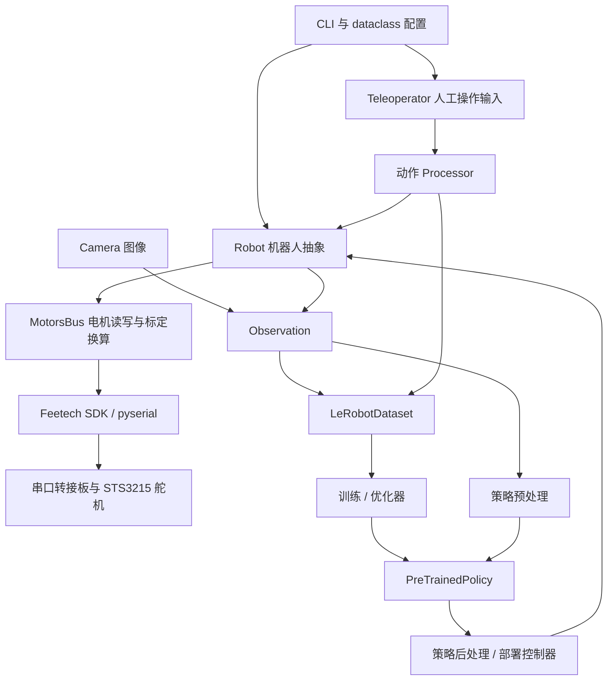
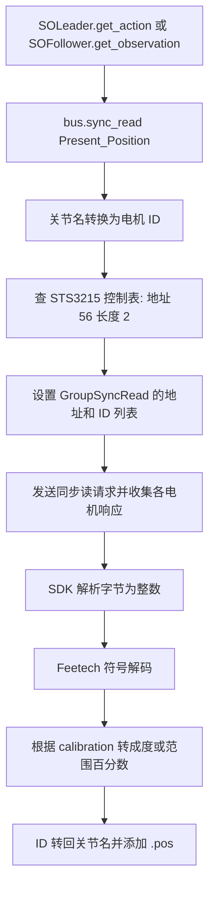
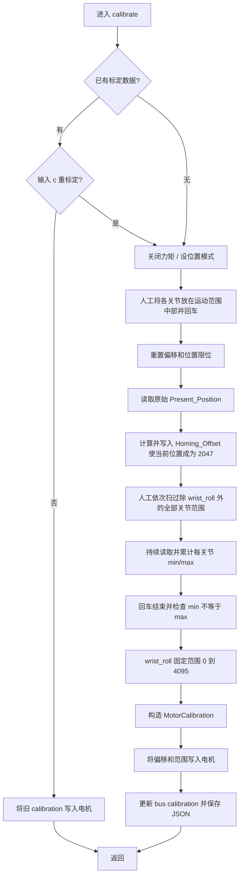
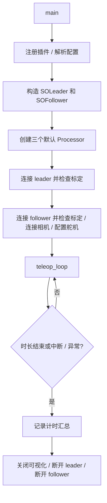

# LeRobot 与 SO-101：工程结构、通信、标定和遥操作源码解析

分析日期：2026-09-09。分析对象是当前工作区 `SoArm101/3rdparty/lerobot` 的实际源码。`pyproject.toml` 声明版本 **0.6.2**、Python **>=3.12**；这是源码声明，不代表已安装的运行环境版本。本文没有连接机械臂或改写舵机参数。

另行下载、只读检查了 `uv.lock` 锁定的 `feetech-servo-sdk==1.0.0` 源码包，SHA-256 与锁文件一致：`d4d3832e4b1b22a8222133a414db9f868224c2fb639426a1b11d96ddfe84e69c`。SDK 用于解释串口报文底层；具体工程行为优先以本地 LeRobot 实现为准。

阅读顺序：工程地图 → SO-101 类与配置 → 连接初始化 → 读取/发送数据 → 标定及换算 → 遥操作完整循环 → 扩展到记录、策略、ROS 2。

## 1. LeRobot 工程整体结构

### 1.1 它解决什么问题

LeRobot 将真实机器人控制、示教采集、数据集、学习策略、训练评估和部署放在同一套 Python 接口体系内。对于当前 SO-101，硬件主线是“通过 Feetech 总线读取位置、写入位置目标”；PyTorch 策略训练属于这条主线的上层。

你的外围项目定位于 ROS 2。当前 `src/so101_core/CMakeLists.txt` 主要是 `ament_cmake/rclcpp` 包骨架，未定义驱动可执行目标。本文追踪的 LeRobot SO-101 主从臂链路直接使用 Python 串口库，没有经过 ROS 2 topic、service、MoveIt 或 `ros2_control`。

### 1.2 顶层目录

下列目录树以 `/Users/lvjiaqing/MyProjects/MyRobot/SoArm101/3rdparty/lerobot` 为根，省略部分辅助文件。

```text
lerobot/
├── pyproject.toml        # 版本、Python 要求、依赖、extras、CLI 入口、工具配置
├── uv.lock               # 依赖锁定结果
├── setup.py              # 构建辅助
├── src/lerobot/          # 可导入的 Python 包，运行逻辑主体
├── tests/                # 单元测试、集成测试、硬件 mock
├── examples/             # 硬件使用、数据、训练等示例
├── docs/source/          # 官方文档源文件，包含 so101.mdx
├── scripts/              # 仓库级辅助脚本；主要 CLI 实现在 src/lerobot/scripts/
├── utils/                # 仓库级辅助工具
├── docker/               # 用户及内部构建容器
├── media/                # 文档和 README 媒体
├── Makefile              # 测试等开发任务
└── AGENTS.md / AGENT_GUIDE.md / CONTRIBUTING.md
```

### 1.3 Python 包内部的职责

| 模块                               | 核心职责                                                       | 与 SO-101 主线的关系                                |
| ---------------------------------- | -------------------------------------------------------------- | --------------------------------------------------- |
| `scripts/`                         | 命令行调度：标定、遥操作、采集、训练、回放、部署               | 用户入口，组织对象和循环                            |
| `configs/`                         | dataclass 配置、CLI 解析、策略/训练配置                        | 将参数转换为结构化配置                              |
| `robots/`                          | `Robot` 抽象与 follower 实现                                   | 读取从臂状态、向从臂发送动作                        |
| `teleoperators/`                   | `Teleoperator` 抽象与 leader/键盘/手机等实现                   | 产生人工动作                                        |
| `motors/`                          | 电机模型、标定结构、总线、寄存器读写和数值转换                 | SO-101 的核心底层                                   |
| `cameras/`                         | OpenCV、RealSense 等相机                                       | 将图像加入 observation                              |
| `processor/`                       | 动作、观测、策略输入输出变换管线                               | 默认遥操作使用 Identity；也可扩展 FK/IK、坐标转换等 |
| `lerobot_types.py`                 | 动作、观测、策略输入输出等类型定义                             | 各模块交换数据的接口约定                            |
| `datasets/`                        | `LeRobotDataset`、metadata、读写、图像/视频、统计、采样        | 将示教记录为可训练数据                              |
| `policies/`                        | `PreTrainedPolicy` 与 ACT、Diffusion、SmolVLA、Pi0/Pi05 等实现 | 根据观测预测动作                                    |
| `optim/`、`distributed/`           | 优化器、调度器、并行训练和检查点                               | 训练侧基础设施                                      |
| `envs/`                            | 仿真环境配置与工厂                                             | 仿真训练和评估                                      |
| `rollout/`                         | 控制器、推理后端、交互和部署策略                               | 真实机器人策略执行                                  |
| `async_inference/`、`transport/`   | 策略客户端/服务端、gRPC 消息和通信工具                         | 远程/异步推理；普通双臂遥操作不经过此层             |
| `model/kinematics.py`              | 机器人运动学工具                                               | 末端控制时使用                                      |
| `rl/`                              | actor、learner、buffer、SAC 等                                 | 强化学习分支                                        |
| `rewards/`                         | 奖励模型及分类器                                               | 任务评价和学习                                      |
| `annotations/`、`data_processing/` | 视频/任务标注与数据加工                                        | 数据准备                                            |
| `jobs/`                            | Hugging Face Jobs 等任务调度辅助                               | 云端训练/数据任务                                   |
| `transforms/`、`utils/`、`common/` | 图像变换、计时、可视化、训练/控制通用工具                      | 跨模块复用；`common/` 目前仍有实际实现              |
| `templates/`                       | 模型卡模板                                                     | Hub 发布元数据                                      |

`datasets/` 与 `policies/` 的两个核心接口：`LeRobotDataset.add_frame()/save_episode()/__getitem__()` 管理数据；`PreTrainedPolicy.forward()` 面向训练，`select_action()` 面向动作推理。它们最终与硬件共享 observation/action 语义。

### 1.4 工程关系图



这是工程级功能关系图，各分支不是在普通遥操作时同时运行。普通 SO-101 主从遥操作不需要先训练神经网络。

### 1.5 CLI 入口具体在哪

`pyproject.toml` 将 console scripts 映射到 Python 函数。例如：

源码：[pyproject.toml:350](/Users/lvjiaqing/MyProjects/MyRobot/SoArm101/3rdparty/lerobot/pyproject.toml:350)。以下为该位置的原始摘录。

```toml
[project.scripts]
lerobot-calibrate="lerobot.scripts.lerobot_calibrate:main"
lerobot-find-cameras="lerobot.scripts.lerobot_find_cameras:main"
lerobot-find-port="lerobot.scripts.lerobot_find_port:main"
lerobot-record="lerobot.scripts.lerobot_record:main"
lerobot-replay="lerobot.scripts.lerobot_replay:main"
lerobot-setup-motors="lerobot.scripts.lerobot_setup_motors:main"
lerobot-teleoperate="lerobot.scripts.lerobot_teleoperate:main"
```

完整关系为：

| 入口名                 | 实现                           | 作用                       |
| ---------------------- | ------------------------------ | -------------------------- |
| `lerobot-find-port`    | `lerobot_find_port.py:main`    | 查找串口                   |
| `lerobot-setup-motors` | `lerobot_setup_motors.py:main` | 初始化电机 ID 与波特率     |
| `lerobot-calibrate`    | `lerobot_calibrate.py:main`    | 对 leader 或 follower 标定 |
| `lerobot-teleoperate`  | `lerobot_teleoperate.py:main`  | 人工控制循环               |
| `lerobot-record`       | `lerobot_record.py:main`       | 示教与数据记录             |
| `lerobot-replay`       | `lerobot_replay.py:main`       | 回放动作                   |
| `lerobot-train`        | `lerobot_train.py:main`        | 训练策略                   |
| `lerobot-eval`         | `lerobot_eval.py:main`         | 评估入口                   |
| `lerobot-rollout`      | `lerobot_rollout.py:main`      | 策略部署入口               |

这张表用于定位源码，不是对已连接硬件的操作指令。

## 2. SO-101 在这份代码中的准确位置

### 2.1 SO-101 和 SO-100 已共用实现

Follower 的主文件是：

- [so_follower.py](/Users/lvjiaqing/MyProjects/MyRobot/SoArm101/3rdparty/lerobot/src/lerobot/robots/so_follower/so_follower.py:37)
- [config_so_follower.py](/Users/lvjiaqing/MyProjects/MyRobot/SoArm101/3rdparty/lerobot/src/lerobot/robots/so_follower/config_so_follower.py:24)

Leader 的主文件是：

- [so_leader.py](/Users/lvjiaqing/MyProjects/MyRobot/SoArm101/3rdparty/lerobot/src/lerobot/teleoperators/so_leader/so_leader.py:33)
- [config_so_leader.py](/Users/lvjiaqing/MyProjects/MyRobot/SoArm101/3rdparty/lerobot/src/lerobot/teleoperators/so_leader/config_so_leader.py:22)

实际别名定义：

源码：[so_follower.py:241](/Users/lvjiaqing/MyProjects/MyRobot/SoArm101/3rdparty/lerobot/src/lerobot/robots/so_follower/so_follower.py:241)。以下为该位置的原始摘录。

```python
SO100Follower = SOFollower
SO101Follower = SOFollower
```

源码：[so_leader.py:166](/Users/lvjiaqing/MyProjects/MyRobot/SoArm101/3rdparty/lerobot/src/lerobot/teleoperators/so_leader/so_leader.py:166)。以下为该位置的原始摘录。

```python
SO100Leader = SOLeader
SO101Leader = SOLeader
```

因此，`SO101Follower` 不是另一份独立控制算法；它就是 `SOFollower`。`SO101Leader` 同理。配置仍注册了 `so101_follower/so101_leader` 等名称，工厂据此创建对象。

一个容易混淆的地方：CLI 选择字符串是 `so101_follower`，而类的 `name` 是 `so_follower`。默认标定目录由后者决定。

### 2.2 六个控制通道

源码：[so_follower.py:49](/Users/lvjiaqing/MyProjects/MyRobot/SoArm101/3rdparty/lerobot/src/lerobot/robots/so_follower/so_follower.py:49)。以下为该位置的原始摘录。

```python
# choose normalization mode depending on config if available
norm_mode_body = MotorNormMode.DEGREES if config.use_degrees else MotorNormMode.RANGE_M100_100
self.bus = FeetechMotorsBus(
    port=self.config.port,
    motors={
        "shoulder_pan": Motor(1, "sts3215", norm_mode_body),
        "shoulder_lift": Motor(2, "sts3215", norm_mode_body),
        "elbow_flex": Motor(3, "sts3215", norm_mode_body),
        "wrist_flex": Motor(4, "sts3215", norm_mode_body),
        "wrist_roll": Motor(5, "sts3215", norm_mode_body),
        "gripper": Motor(6, "sts3215", MotorNormMode.RANGE_0_100),
    },
    calibration=self.calibration,
)
```

|   ID | 程序名          | 机械含义           | 当前默认对外单位 |
| ---: | --------------- | ------------------ | ---------------- |
|    1 | `shoulder_pan`  | 底座/肩部水平旋转  | 度               |
|    2 | `shoulder_lift` | 肩部抬升           | 度               |
|    3 | `elbow_flex`    | 肘部弯曲           | 度               |
|    4 | `wrist_flex`    | 腕部俯仰           | 度               |
|    5 | `wrist_roll`    | 腕部轴向旋转       | 度               |
|    6 | `gripper`       | 夹爪开合或主臂手柄 | 标定范围的 0–100 |

按这里的控制通道可理解为五个臂关节加一个夹爪通道，不能据“六个电机”就认为它是可以独立控制末端六维位姿的六轴工业机械臂。

软件两端均声明 `sts3215`。官方机械说明中的 follower 使用 1/345 齿比，leader 则按关节搭配不同齿比，以兼顾支撑与手动推动。软件映射相同不代表机械内部完全相同。[官方 SO-101 硬件说明](https://huggingface.co/docs/lerobot/en/so101)

### 2.3 三种“身份”不要混用

| 参数/字段   | 例子                   | 意义                       |
| ----------- | ---------------------- | -------------------------- |
| `port`      | 系统分配的串口设备路径 | 选择哪块控制板/哪条总线    |
| `config.id` | `my_follower_arm`      | 选择哪一台机械臂的标定文件 |
| `Motor.id`  | 1–6                    | 在选定总线上寻址具体舵机   |

Leader 和 follower 通常各有一块 USB 总线转接板，属于两条独立总线；因此它们可以各自拥有 ID 1–6。`config.id` 不会改变电机地址。

## 3. 配置、对象所有权和连接初始化

### 3.1 默认配置决定实际行为

| 配置                           | Follower 默认值 | 含义                                   |
| ------------------------------ | --------------: | -------------------------------------- |
| `use_degrees`                  |          `True` | 前五个关节输出角度；夹爪仍为 0–100     |
| `max_relative_target`          |          `None` | 默认不开启当前位置到目标位置的差值限制 |
| `disable_torque_on_disconnect` |          `True` | 断开时关闭力矩                         |
| `position_p_coefficient`       |              16 | 连接配置阶段写入舵机 P 系数            |
| `position_i_coefficient`       |               0 | I 系数                                 |
| `position_d_coefficient`       |              32 | D 系数                                 |
| `num_read_retries`             |               2 | 读取失败后额外重试两次，总计最多三次   |
| `cameras`                      |            `{}` | 相机可选                               |

Leader 的 `use_degrees=True`、`num_read_retries=2`。关节空间直接映射要求两端的位置表示一致；若一侧是度、另一侧是 -100–100，Identity processor 不会自动修复单位不一致。

源码依据：[Follower 配置](/Users/lvjiaqing/MyProjects/MyRobot/SoArm101/3rdparty/lerobot/src/lerobot/robots/so_follower/config_so_follower.py:24)、[Leader 配置](/Users/lvjiaqing/MyProjects/MyRobot/SoArm101/3rdparty/lerobot/src/lerobot/teleoperators/so_leader/config_so_leader.py:22)。

### 3.2 对象如何构造

```text
命令参数
  → parser/draccus 解析 dataclass
  → TeleoperateConfig(robot=..., teleop=...)
  → make_robot_from_config / make_teleoperator_from_config
  → SOFollower / SOLeader
  → 基类按 id 与 calibration_dir 加载 JSON
  → 构造 FeetechMotorsBus，并传入电机表和 calibration
  → follower 额外构造 cameras
```

工厂入口：[robots/utils.py](/Users/lvjiaqing/MyProjects/MyRobot/SoArm101/3rdparty/lerobot/src/lerobot/robots/utils.py:27)、[teleoperators/utils.py](/Users/lvjiaqing/MyProjects/MyRobot/SoArm101/3rdparty/lerobot/src/lerobot/teleoperators/utils.py:50)。

每个臂对象持有自己的 `bus`；总线对象持有串口、包处理器和同步读写对象；follower 还持有相机对象。上层循环拿到的是按关节名组织的 Python 字典，不需要关心报文地址或编码器整数。

### 3.3 Follower 的 connect 不只是打开串口

源码：[so_follower.py:98](/Users/lvjiaqing/MyProjects/MyRobot/SoArm101/3rdparty/lerobot/src/lerobot/robots/so_follower/so_follower.py:98)。以下为该位置的原始摘录。

```python
self.bus.connect()
if not self.is_calibrated and calibrate:
    logger.info(
        "Mismatch between calibration values in the motor and the calibration file or no calibration file found"
    )
    self.calibrate()

for cam in self.cameras.values():
    cam.connect()

self.configure()
logger.info(f"{self} connected.")
```

含义依次是：

1. `bus.connect()` 打开串口，检查目标电机是否存在、型号是否匹配、固件是否一致。
2. 比较电机内的标定与当前 JSON；不一致且允许标定时，进入交互式 `calibrate()`。
3. 连接所有已配置相机。
4. `configure()` 写运行参数。

总线握手检查预期 ID 和型号，不是只看 USB 设备能否打开。STS3215 的本地型号表使用 `777` 作为型号编号。

Follower 配置时临时禁用力矩，配置结束后重新启用：

源码：[so_follower.py:159](/Users/lvjiaqing/MyProjects/MyRobot/SoArm101/3rdparty/lerobot/src/lerobot/robots/so_follower/so_follower.py:159)。以下为该位置的原始摘录。

```python
def configure(self) -> None:
    with self.bus.torque_disabled():
        self.bus.configure_motors()
        for motor in self.bus.motors:
            self.bus.write("Operating_Mode", motor, OperatingMode.POSITION.value)
            self.bus.write("P_Coefficient", motor, self.config.position_p_coefficient)
            self.bus.write("I_Coefficient", motor, self.config.position_i_coefficient)
            self.bus.write("D_Coefficient", motor, self.config.position_d_coefficient)

            if motor == "gripper":
                self.bus.write("Max_Torque_Limit", motor, 500)  # 50% of max torque to avoid burnout
                self.bus.write("Protection_Current", motor, 250)  # 50% of max current to avoid burnout
                self.bus.write("Overload_Torque", motor, 25)  # 25% torque when overloaded
```

`torque_disabled()` 使用 `try/finally`，退出时调用 `enable_torque()`。它不是“恢复进入前状态”的通用状态保存器，而是退出时明确启用力矩。

`configure_motors()` 还会设置响应延迟、加速度参数，并清除 STS3215 `Phase` 的 bit 4，使位置反馈采用 0–4095 的单圈表示。夹爪另外设置扭矩与电流保护寄存器；上面的 500、250、25 是寄存器值，不能脱离设备手册直接解释为 N·m 或 A。

### 3.4 Leader 为什么能被手动推动

源码：[so_leader.py:127](/Users/lvjiaqing/MyProjects/MyRobot/SoArm101/3rdparty/lerobot/src/lerobot/teleoperators/so_leader/so_leader.py:127)。以下为该位置的原始摘录。

```python
def configure(self) -> None:
    self.bus.disable_torque()
    self.bus.configure_motors()
    for motor in self.bus.motors:
        self.bus.write("Operating_Mode", motor, OperatingMode.POSITION.value)
```

Leader 配置完成后维持力矩关闭；它仍通电、仍能读取编码器，只是不主动保持位置。Follower 则启用力矩，在位置模式下跟踪目标。

“Leader 力矩关闭”与“Leader 断电”是不同状态。

## 4. 怎样获取机械臂数据

### 4.1 Robot 层的数据合同

Follower 的 `observation_features` 由六个 `<joint>.pos` 标量和可选相机特征组成；`action_features` 只有六个位置标量。示例形式如下，数值仅用于说明结构：

```python
{
    "shoulder_pan.pos": 10.0,
    "shoulder_lift.pos": -20.0,
    "elbow_flex.pos": 35.0,
    "wrist_flex.pos": 5.0,
    "wrist_roll.pos": 0.0,
    "gripper.pos": 50.0,
    # 有相机时，还会加入对应名称的图像数组
}
```

前五项为度，最后一项为夹爪范围百分数。这里的 `.pos` 是关节位置键名，不表示每个值都使用同一种物理单位。

### 4.2 Follower.get_observation

源码：[so_follower.py:179](/Users/lvjiaqing/MyProjects/MyRobot/SoArm101/3rdparty/lerobot/src/lerobot/robots/so_follower/so_follower.py:179)。以下为该位置的原始摘录。

```python
@check_if_not_connected
def get_observation(self) -> RobotObservation:
    # Read arm position
    start = time.perf_counter()
    obs_dict = self.bus.sync_read("Present_Position", num_retry=self.config.num_read_retries)
    obs_dict = {f"{motor}.pos": val for motor, val in obs_dict.items()}
    dt_ms = (time.perf_counter() - start) * 1e3
    logger.debug(f"{self} read state: {dt_ms:.1f}ms")
```

一次 `sync_read("Present_Position")` 请求读出这条总线上所有配置电机的位置。总线返回 `{"shoulder_pan": ...}`；Robot 层增加 `.pos` 后缀以统一动作/观测接口。

随后遍历相机，调用 `read_latest()`；若相机启用深度，则还读取 `<camera>_depth`。因此：

- 不配置相机，仍然可以获得完整关节状态并进行主从遥操作。
- 默认观测没有速度、电流、电压、温度，也没有末端 x/y/z。
- 相机和六个关节并非在同一硬件时刻被严格同步采样。

### 4.3 Leader.get_action 本质上也在读当前位置

源码：[so_leader.py:145](/Users/lvjiaqing/MyProjects/MyRobot/SoArm101/3rdparty/lerobot/src/lerobot/teleoperators/so_leader/so_leader.py:145)。以下为该位置的原始摘录。

```python
@check_if_not_connected
def get_action(self) -> dict[str, float]:
    start = time.perf_counter()
    action = self.bus.sync_read("Present_Position", num_retry=self.config.num_read_retries)
    action = {f"{motor}.pos": val for motor, val in action.items()}
    dt_ms = (time.perf_counter() - start) * 1e3
    logger.debug(f"{self} read action: {dt_ms:.1f}ms")
    return action
```

同样的读取操作，在 follower 上叫 observation，在 leader 上叫 action。原因是主臂当前姿态被用作从臂的目标姿态；action 并不必然来自神经网络。

### 4.4 从寄存器名到读取报文

`FeetechMotorsBus` 继承 `SerialMotorsBus`，复用通用收发逻辑，提供 Feetech 寄存器表、编码方式和 SDK 对象。



控制表位置：[tables.py](/Users/lvjiaqing/MyProjects/MyRobot/SoArm101/3rdparty/lerobot/src/lerobot/motors/feetech/tables.py:41)。

| 寄存器                | 十进制地址 | 字节数 | 用途                 |
| --------------------- | ---------: | -----: | -------------------- |
| `ID`                  |          5 |      1 | 舵机总线地址         |
| `Baud_Rate`           |          6 |      1 | 波特率枚举值         |
| `Min_Position_Limit`  |          9 |      2 | 位置下限             |
| `Max_Position_Limit`  |         11 |      2 | 位置上限             |
| `Homing_Offset`       |         31 |      2 | 编码器偏移           |
| `Operating_Mode`      |         33 |      1 | 控制模式，POSITION=0 |
| `Torque_Enable`       |         40 |      1 | 力矩开关             |
| `Goal_Position`       |         42 |      2 | 目标位置             |
| `Lock`                |         55 |      1 | 非易失配置区写入锁   |
| `Present_Position`    |         56 |      2 | 当前编码器位置       |
| `Present_Velocity`    |         58 |      2 | 速度寄存器           |
| `Present_Load`        |         60 |      2 | 负载寄存器           |
| `Present_Voltage`     |         62 |      1 | 电压寄存器           |
| `Present_Temperature` |         63 |      1 | 温度寄存器           |
| `Status`              |         65 |      1 | 状态                 |
| `Moving`              |         66 |      1 | 运动状态             |
| `Present_Current`     |         69 |      2 | 电流寄存器           |

总线的读取与换算核心：

源码：[motors_bus.py:1157](/Users/lvjiaqing/MyProjects/MyRobot/SoArm101/3rdparty/lerobot/src/lerobot/motors/motors_bus.py:1157)。以下为该位置的原始摘录。

```python
model = next(iter(models))
addr, length = get_address(self.model_ctrl_table, model, data_name)

err_msg = f"Failed to sync read '{data_name}' on {ids=} after {num_retry + 1} tries."
raw_ids_values, _ = self._sync_read(
    addr, length, ids, num_retry=num_retry, raise_on_error=True, err_msg=err_msg
)

decoded = self._decode_sign(data_name, raw_ids_values)

if normalize and data_name in self.normalized_data:
    normalized = self._normalize(decoded)
    return {self._id_to_name(id_): value for id_, value in normalized.items()}

return {self._id_to_name(id_): value for id_, value in decoded.items()}
```

只有 `Goal_Position` 与 `Present_Position` 被列入 Feetech 的 `normalized_data`。读取电流或速度不会自动转换成 A、rad/s 等工程单位；即使调用时保留 `normalize=True`，不在这个列表中的寄存器仍只做对应的底层解码。

`normalize=False` 表示“不做 LeRobot 位置单位换算”。它仍会经过 SDK 字节解码和 Feetech 符号解码，而且 `Present_Position` 仍可能已经应用舵机中的 `Homing_Offset`，不能把它视为“从未标定过的物理编码器值”。

### 4.5 批量读取和错误处理

源码：[motors_bus.py:1183](/Users/lvjiaqing/MyProjects/MyRobot/SoArm101/3rdparty/lerobot/src/lerobot/motors/motors_bus.py:1183)。以下为该位置的原始摘录。

```python
self._setup_sync_reader(motor_ids, addr, length)
for n_try in range(1 + num_retry):
    comm = self.sync_reader.txRxPacket()
    if self._is_comm_success(comm):
        break
    logger.debug(
        f"Failed to sync read @{addr=} ({length=}) on {motor_ids=} ({n_try=}): "
        + self.packet_handler.getTxRxResult(comm)
    )

if not self._is_comm_success(comm) and raise_on_error:
    raise ConnectionError(f"{err_msg} {self.packet_handler.getTxRxResult(comm)}")

values = {id_: self.sync_reader.getData(id_, addr, length) for id_ in motor_ids}
return values, comm
```

`num_retry=2` 表示最多 3 次尝试，而不是总共 2 次。失败会抛出 `ConnectionError`，不会返回上次缓存姿态继续控制。

这里的“sync”表示一组电机使用同一条批量读取指令；串行总线上各响应依次返回，不意味着六个编码器在同一时钟沿锁存。在锁定 SDK 中，`GroupSyncRead.rxPacket()` 依次调用各 ID 的 `readRx()`。另外，这个 SDK 的 group read 丢弃了逐电机返回的 error 字段，因此不能将“同步读通信成功”理解成已经完成全面的舵机故障诊断。

### 4.6 相机的数据与线程

OpenCV 相机使用后台线程不断采集和预处理图像，然后在锁内替换 `latest_frame/latest_timestamp`。`read_latest()` 读取最近一帧，默认拒绝超过 500 ms 的陈旧帧，不会等待下一帧才返回。

因此 60 Hz 的机械臂循环可以多次使用一张 30 FPS 相机图像。这个机制有助于避免相机帧率直接限制控制循环，但不提供图像与关节的严格硬件同步。

源码：[采集线程](/Users/lvjiaqing/MyProjects/MyRobot/SoArm101/3rdparty/lerobot/src/lerobot/cameras/opencv/camera_opencv.py:454)、[read_latest](/Users/lvjiaqing/MyProjects/MyRobot/SoArm101/3rdparty/lerobot/src/lerobot/cameras/opencv/camera_opencv.py:582)。`read_latest()` 返回缓存数组引用而非拷贝；如果上层要原地画图或改像素，应该先复制，避免修改共享帧。

## 5. 怎样向机械臂发送数据

### 5.1 SOFollower.send_action 接收绝对位置目标

源码：[so_follower.py:219](/Users/lvjiaqing/MyProjects/MyRobot/SoArm101/3rdparty/lerobot/src/lerobot/robots/so_follower/so_follower.py:219)。以下为该位置的原始摘录。

```python
goal_pos = {key.removesuffix(".pos"): val for key, val in action.items() if key.endswith(".pos")}

# Cap goal position when too far away from present position.
# /!\ Slower fps expected due to reading from the follower.
if self.config.max_relative_target is not None:
    present_pos = self.bus.sync_read("Present_Position", num_retry=self.config.num_read_retries)
    goal_present_pos = {key: (g_pos, present_pos[key]) for key, g_pos in goal_pos.items()}
    goal_pos = ensure_safe_goal_position(goal_present_pos, self.config.max_relative_target)

# Send goal position to the arm
self.bus.sync_write("Goal_Position", goal_pos)
return {f"{motor}.pos": val for motor, val in goal_pos.items()}
```

这段代码分三步：

1. 仅选出以 `.pos` 结尾的键，移除后缀，得到电机目标字典。
2. 如配置了 `max_relative_target`，重新读取从臂当前位置并限制目标差值。
3. 向 `Goal_Position` 批量写入位置目标，返回软件层实际选定的目标。

`action` 中的值是目标位置。例如 `shoulder_pan.pos=30` 在默认模式下表示“去标定坐标下的 30 度”，并不是“再转动 30 度”。该接口没有在 Python 中执行一条完整轨迹，也没有等待所有关节到位才返回。

这里允许按所提供的关节子集发送目标；未包含的电机不会在该批次中收到新目标。上层仍须保证关节名有效、目标有意义。`.pos` 过滤本身不是全面的动作校验器。

### 5.2 max_relative_target 限制什么

核心公式为：

```text
安全目标 = 当前实测位置 + clamp(请求目标 - 当前实测位置, -限值, +限值)
```

源码：[utils.py:107](/Users/lvjiaqing/MyProjects/MyRobot/SoArm101/3rdparty/lerobot/src/lerobot/robots/utils.py:107)。以下为该位置的原始摘录。

```python
warnings_dict = {}
safe_goal_positions = {}
for key, (goal_pos, present_pos) in goal_present_pos.items():
    diff = goal_pos - present_pos
    max_diff = diff_cap[key]
    safe_diff = min(diff, max_diff)
    safe_diff = max(safe_diff, -max_diff)
    safe_goal_pos = present_pos + safe_diff
    safe_goal_positions[key] = safe_goal_pos
```

假设肩关节实测 10°，请求 80°，限值 5.0，则本次软件目标为 15°。

它约束的是“当前实测位置到目标的距离”，不是相邻两个已发送目标之间的差值，更不是严格的关节速度或加速度限制。由于没有乘以 `dt`，不能直接把 `5.0` 解读为 5°/s。

当前默认值为 `None`，即默认不执行该限制。启用后每周期会多一次 follower 位置读取；且同一个标量对前五个关节表示角度差，对夹爪表示 0–100 范围中的百分点。若传字典，键必须与这次目标的关节集合一致；若直接用 Python 调用，当前实现接受标量 `float`，不是任意数字类型。

### 5.3 从关节目标到原始目标值

源码：[motors_bus.py:1248](/Users/lvjiaqing/MyProjects/MyRobot/SoArm101/3rdparty/lerobot/src/lerobot/motors/motors_bus.py:1248)。以下为该位置的原始摘录。

```python
model = next(iter(models))
addr, length = get_address(self.model_ctrl_table, model, data_name)

int_ids_values = {id_: int(val) for id_, val in raw_ids_values.items()}
if normalize and data_name in self.normalized_data:
    int_ids_values = self._unnormalize(raw_ids_values)

int_ids_values = self._encode_sign(data_name, int_ids_values)

err_msg = f"Failed to sync write '{data_name}' with ids_values={int_ids_values} after {num_retry + 1} tries."
self._sync_write(
    addr, length, int_ids_values, num_retry=num_retry, raise_on_error=True, err_msg=err_msg
)
```

转换顺序为：关节名 → ID → 查寄存器地址 → 使用 follower 自己的标定反换算 → Feetech 符号编码 → 按长度拆字节 → group write。

`_unnormalize()` 生成整数存在量化。`send_action()` 返回值保留的是软件目标，它不包含反归一化截断到整数后的微小偏差，也不是电机“已经到位”的回执。

### 5.4 单电机 write 与 sync_write 的区别

| 接口           | 发给谁               | 是否等待该电机状态响应 | 常见用途                   |
| -------------- | -------------------- | ---------------------- | -------------------------- |
| `read()`       | 单个电机             | 是                     | 配置检查、单项诊断         |
| `sync_read()`  | 多个电机的同一寄存器 | 收集多电机响应         | 实时位置读取               |
| `write()`      | 单个电机             | 是                     | ID、标定、模式、PID 等配置 |
| `sync_write()` | 多个电机的同一寄存器 | 不等待逐电机写入确认   | 高频位置目标下发           |

SDK 的发送成功只表明相应发送步骤成功，不能证明所有电机都接收并执行，也不能证明已经到达目标。判断实际运动必须继续读取 `Present_Position`，必要时读取 `Moving/Status` 等设备状态。

依据：[write](/Users/lvjiaqing/MyProjects/MyRobot/SoArm101/3rdparty/lerobot/src/lerobot/motors/motors_bus.py:1067)、[sync_write](/Users/lvjiaqing/MyProjects/MyRobot/SoArm101/3rdparty/lerobot/src/lerobot/motors/motors_bus.py:1221)。

### 5.5 位置闭环究竟在哪


LeRobot 负责周期性目标生成和传输，并在连接阶段配置位置控制相关参数；具体电机内部的反馈控制由舵机固件执行。仓库没有提供该固件的完整闭环算法，不能据寄存器名称推断其全部控制细节。

## 6. 再往下一层：SDK、串口与实际报文

### 6.1 这条链路的层次

```text
LeRobot Robot/Teleoperator
  → FeetechMotorsBus / SerialMotorsBus
  → scservo_sdk.GroupSyncRead / GroupSyncWrite
  → protocol_packet_handler.py
  → PortHandler.readPort / writePort
  → pyserial Serial.read / Serial.write
  → 操作系统串口驱动
  → USB 总线转接板
  → 舵机串行总线
```

本地 Feetech 类创建了以下 SDK 对象：

源码：[feetech.py:122](/Users/lvjiaqing/MyProjects/MyRobot/SoArm101/3rdparty/lerobot/src/lerobot/motors/feetech/feetech.py:122)。以下为该位置的原始摘录。

```python
self.packet_handler = scs.PacketHandler(protocol_version)
self.sync_reader = scs.GroupSyncRead(self.port_handler, self.packet_handler, 0, 0)
self.sync_writer = scs.GroupSyncWrite(self.port_handler, self.packet_handler, 0, 0)
```

默认波特率为 1,000,000，SO-101 的 STS3215 走该 SDK 的 `protocol_version=0` 分支。这个“0”是此 SDK 的版本/模式参数，不应直接套用其他厂商同名协议的含义。

底层文件来自锁定依赖包，而不在 LeRobot 自己的源码目录内。本次检查副本位于 `/private/tmp/lerobot-sdk-inspection/feetech-servo-sdk-1.0.0/`；依赖版本可追溯到 [uv.lock](/Users/lvjiaqing/MyProjects/MyRobot/SoArm101/3rdparty/lerobot/uv.lock:1531) 和 [Feetech SDK 1.0.0 发布页](https://pypi.org/project/feetech-servo-sdk/1.0.0/)。

SDK 的最末端收发逻辑如下：

源码：[port_handler.py:57](/private/tmp/lerobot-sdk-inspection/feetech-servo-sdk-1.0.0/scservo_sdk/port_handler.py:57)。以下为该位置的原始摘录。

```python
def readPort(self, length):
    if (sys.version_info > (3, 0)):
        return self.ser.read(length)
    else:
        return [ord(ch) for ch in self.ser.read(length)]

def writePort(self, packet):
    return self.ser.write(packet)
```

串口由 `serial.Serial(port=..., baudrate=..., bytesize=serial.EIGHTBITS, timeout=0)` 创建。`timeout=0` 是底层非阻塞读取设置；外层 SDK 自己循环收包并判断包超时，不能因此认为 LeRobot 的 `sync_read()` 对调用者也是非阻塞的。

### 6.2 同步读取六个位置的示例报文

根据锁定 SDK 组包逻辑，读取 ID 1–6 的 `Present_Position`，完整请求为：

```text
FF FF FE 0A 82 38 02 01 02 03 04 05 06 26
│     │  │  │  │  │  └─────────────┘  └─ 校验和
│     │  │  │  │  │       电机 ID 1–6
│     │  │  │  │  └─ 每个电机读取 2 字节
│     │  │  │  └─ 起始地址 0x38 = 56
│     │  │  └─ 同步读指令 0x82
│     │  └─ LENGTH = 0x0A
│     └─ 广播 ID 0xFE
└─ 帧头 FF FF
```

校验算法为 `~sum(ID 到最后一个参数字节) & 0xFF`。这个包只读寄存器，不要求机械臂移动。上述字节是由源码组包规则计算的示例，并非现场串口抓包。

SDK 发一次请求，随后依次收集六个舵机的状态包；对于两字节位置，在此配置下按低字节、高字节组装整数，再交给 LeRobot 解码和换算。

源码：[syncReadTx](/private/tmp/lerobot-sdk-inspection/feetech-servo-sdk-1.0.0/scservo_sdk/protocol_packet_handler.py:431)、[接收各 ID](/private/tmp/lerobot-sdk-inspection/feetech-servo-sdk-1.0.0/scservo_sdk/group_sync_read.py:58)、[校验和](/private/tmp/lerobot-sdk-inspection/feetech-servo-sdk-1.0.0/scservo_sdk/protocol_packet_handler.py:69)。

### 6.3 同步写入六个目标的包格式

```text
FF FF FE 16 83 2A 02
01 P1_L P1_H
02 P2_L P2_H
03 P3_L P3_H
04 P4_L P4_H
05 P5_L P5_H
06 P6_L P6_H
CHECKSUM
```

`0x83` 为同步写，`0x2A=42` 为 `Goal_Position`，每个目标两字节。六个电机每个携带“1 字节 ID + 2 字节目标”，参数数据共 18 字节，LENGTH=18+4=22，即 `0x16`，全包 26 字节。

例如后文算出的 follower 肩关节目标 `2484=0x09B4`，数据字节就是 `B4 09`。默认角度值不会作为 IEEE 浮点数原样发上总线。

### 6.4 符号编码与超时细节

Feetech 对部分寄存器使用“符号位 + 绝对值”编码；不能统一按 C/C++ 的 `int16_t` 补码解释。其中 `Homing_Offset` 的符号位是 bit 11，位置/速度相关寄存器使用对应表中的 bit 15。源码：[编码表](/Users/lvjiaqing/MyProjects/MyRobot/SoArm101/3rdparty/lerobot/src/lerobot/motors/feetech/tables.py:206)、[编码/解码](/Users/lvjiaqing/MyProjects/MyRobot/SoArm101/3rdparty/lerobot/src/lerobot/motors/feetech/feetech.py:307)。

本地还给 SDK 的 `PortHandler.setPacketTimeout` 打了补丁。虽然 Feetech 类声明 `DEFAULT_TIMEOUT_MS=1000`，同步读发包时 SDK 会按包长重新设定超时，并采用该补丁，所以不能把每次同步读的等待时间机械地认定为 1 秒。

对上述六电机、每项两字节的读取，SDK 请求超时计算长度为 `(6+2)*6=48` 字节；在 1 Mbps 下补丁公式对应约 `0.48+0.03+50=50.51 ms`。这是源码中定时阈值的计算，不是实测单次读取耗时；正常响应通常会在阈值前结束，失败重试才可能显著拖慢循环。源码：[超时补丁](/Users/lvjiaqing/MyProjects/MyRobot/SoArm101/3rdparty/lerobot/src/lerobot/motors/feetech/feetech.py:76)。

## 7. 电机初始化与标定是两件事

### 7.1 setup_motors：先解决“如何找到每个电机”

SO-101 两端都按 `reversed(self.bus.motors)` 遍历，因此交互顺序是夹爪 6 → 腕旋转 5 → 腕俯仰 4 → 肘 3 → 肩抬升 2 → 底座 1。

源码：[so_follower.py:173](/Users/lvjiaqing/MyProjects/MyRobot/SoArm101/3rdparty/lerobot/src/lerobot/robots/so_follower/so_follower.py:173)。以下为该位置的原始摘录。

```python
def setup_motors(self) -> None:
    for motor in reversed(self.bus.motors):
        input(f"Connect the controller board to the '{motor}' motor only and press enter.")
        self.bus.setup_motor(motor)
        print(f"'{motor}' motor id set to {self.bus.motors[motor].id}")
```

每次只将当前一个电机接到控制板，由 `setup_motor()` 扫描它现有的 ID 和波特率，再禁用力矩、解锁、写目标 ID、写默认波特率枚举，最后调整主机串口波特率。

```text
只连接一个电机
  → 不做完整六电机握手地打开串口
  → 扫描该电机当前 ID/波特率
  → 关闭力矩并解锁
  → 写 ID
  → 写 Baud_Rate，1 Mbps 对应枚举值 0
  → 主机串口切回 1 Mbps
  → 下一个电机
```

源码：[setup_motor](/Users/lvjiaqing/MyProjects/MyRobot/SoArm101/3rdparty/lerobot/src/lerobot/motors/motors_bus.py:589)。这一步解决通信寻址，不建立关节坐标。官方说明也把它与校准明确分为两个阶段。[SO-101 初始化说明](https://huggingface.co/docs/lerobot/en/so101)

### 7.2 calibrate：再解决“位置值意味着什么”

标定建立每个关节的编码器偏移、运动范围和位置表示。目标是不同个体的机械臂在可比姿态下产生可比的位置数据；实际精度仍取决于安装与手动采集质量。

这里的标定没有识别连杆长度、DH 参数、相机内参或手眼外参。它是**舵机/关节位置标定**。

## 8. 标定校准的完整实际逻辑

### 8.1 标定入口与旧标定复用

`CalibrateConfig` 要求只选择 robot 或 teleop 之一。入口先 `device.connect(calibrate=False)`，再显式 `device.calibrate()`，最后在 `finally` 中断开设备。

源码：[lerobot_calibrate.py:96](/Users/lvjiaqing/MyProjects/MyRobot/SoArm101/3rdparty/lerobot/src/lerobot/scripts/lerobot_calibrate.py:96)。以下为该位置的原始摘录。

```python
device.connect(calibrate=False)

try:
    device.calibrate()
finally:
    device.disconnect()
```

`calibrate=False` 只关闭连接期间的自动标定；仍执行连接和配置，包括 follower 的模式/PID/力矩配置。它不是“只打开串口，不改寄存器”的只读模式。

如果已有 JSON，`calibrate()` 会让操作者选择：输入 `c` 重新采集；其他输入（包括直接回车）则将现有标定写入电机后返回。因此，调用一次标定入口不等于一定重测了所有关节。

### 8.2 新标定流程图



Follower 和 leader 使用相同主流程，但每个实体分别采集自己的数值，不能因为型号一致就把主臂文件当成从臂文件。

### 8.3 第一步：将人工中间姿态移到编码器 2047

源码：[motors_bus.py:789](/Users/lvjiaqing/MyProjects/MyRobot/SoArm101/3rdparty/lerobot/src/lerobot/motors/motors_bus.py:789)。以下为该位置的原始摘录。

```python
motor_names = self._get_motors_list(motors)

self.reset_calibration(motor_names)
actual_positions = self.sync_read("Present_Position", motor_names, normalize=False)
homing_offsets = self._get_half_turn_homings(actual_positions)
for motor, offset in homing_offsets.items():
    self.write("Homing_Offset", motor, offset)

return homing_offsets
```

`reset_calibration()` 把 `Homing_Offset` 写为 0，把限位暂时写为完整 `0..4095`，并清空总线内存标定。因此重复标定不会简单地在旧偏移上继续累加。

Feetech 计算偏移的实现：

源码：[feetech.py:278](/Users/lvjiaqing/MyProjects/MyRobot/SoArm101/3rdparty/lerobot/src/lerobot/motors/feetech/feetech.py:278)。以下为该位置的原始摘录。

```python
def _get_half_turn_homings(self, positions: dict[NameOrID, Value]) -> dict[NameOrID, Value]:
    """
    On Feetech Motors:
    Present_Position = Actual_Position - Homing_Offset
    """
    half_turn_homings: dict[NameOrID, Value] = {}
    for motor, pos in positions.items():
        model = self._get_motor_model(motor)
        max_res = self.model_resolution_table[model] - 1
        half_turn_homings[motor] = pos - int(max_res / 2)

    return half_turn_homings
```

对 STS3215：

```text
max_res = 4096 - 1 = 4095
half = int(4095 / 2) = 2047
homing_offset = 当前原始读数 - 2047
```

例如当前读数 3000，则偏移 953，写入后相同姿态对应 `Present_Position=3000-953=2047`。它改变的是编码器报告坐标，标定代码没有通过发送运动目标将机械臂自动移动到该姿态。

这里“移到中间”主要让常用运动区间远离单圈编码器的回绕边界，有利于后续记录连续范围。它还不是运行接口最终的 0°。

### 8.4 第二步：手动扫范围

源码：[so_follower.py:134](/Users/lvjiaqing/MyProjects/MyRobot/SoArm101/3rdparty/lerobot/src/lerobot/robots/so_follower/so_follower.py:134)。以下为该位置的原始摘录。

```python
# Attempt to call record_ranges_of_motion with a reduced motor set when appropriate.
full_turn_motor = "wrist_roll"
unknown_range_motors = [motor for motor in self.bus.motors if motor != full_turn_motor]
print(
    f"Move all joints except '{full_turn_motor}' sequentially through their "
    "entire ranges of motion.\nRecording positions. Press ENTER to stop..."
)
range_mins, range_maxes = self.bus.record_ranges_of_motion(unknown_range_motors)
range_mins[full_turn_motor] = 0
range_maxes[full_turn_motor] = 4095
```

源码：[motors_bus.py:822](/Users/lvjiaqing/MyProjects/MyRobot/SoArm101/3rdparty/lerobot/src/lerobot/motors/motors_bus.py:822)。以下为该位置的原始摘录。

```python
start_positions = self.sync_read("Present_Position", motor_names, normalize=False, num_retry=5)
mins = start_positions.copy()
maxes = start_positions.copy()

user_pressed_enter = False
while not user_pressed_enter:
    positions = self.sync_read("Present_Position", motor_names, normalize=False, num_retry=5)
    mins = {motor: min(positions[motor], min_) for motor, min_ in mins.items()}
    maxes = {motor: max(positions[motor], max_) for motor, max_ in maxes.items()}
```

程序先读取初值作为 min/max，然后约以“每轮读取时间 + 20 ms 休眠”的节奏采样，不断更新最小和最大位置；按回车结束。范围读取使用 `num_retry=5`，失败时最多六次尝试。

`wrist_roll` 被排除在手动范围采样外，并固定为 `0..4095`。这是此实现的专门处理；不是每个关节都固定这个范围，也不能由此推断腕关节允许无限圈连续旋转。

结束检查只要求每个被采集关节的 `min != max`。它不能证明你已经触及真实可用端点：扫得太窄也可能通过检查，但会影响后续中点、范围映射和写入电机的限位。

### 8.5 第三步：保存数据结构并写舵机

源码：[motors_bus.py:175](/Users/lvjiaqing/MyProjects/MyRobot/SoArm101/3rdparty/lerobot/src/lerobot/motors/motors_bus.py:175)。以下为该位置的原始摘录。

```python
@dataclass
class MotorCalibration:
    id: int
    drive_mode: int
    homing_offset: int
    range_min: int
    range_max: int
```

| 字段            | 单位/意义                  | 当前 SO-101 使用方式                    |
| --------------- | -------------------------- | --------------------------------------- |
| `id`            | 整数电机地址               | 对应关节 ID                             |
| `drive_mode`    | 方向标志                   | 标定固定生成 0                          |
| `homing_offset` | 编码器计数偏移             | 写入舵机 `Homing_Offset`                |
| `range_min`     | 标定后报告坐标中的计数下限 | 写入 `Min_Position_Limit`，用于软件映射 |
| `range_max`     | 标定后报告坐标中的计数上限 | 写入 `Max_Position_Limit`，用于软件映射 |

源码：[feetech.py:268](/Users/lvjiaqing/MyProjects/MyRobot/SoArm101/3rdparty/lerobot/src/lerobot/motors/feetech/feetech.py:268)。以下为该位置的原始摘录。

```python
def write_calibration(self, calibration_dict: dict[str, MotorCalibration], cache: bool = True) -> None:
    for motor, calibration in calibration_dict.items():
        if self.protocol_version == 0:
            self.write("Homing_Offset", motor, calibration.homing_offset)
        self.write("Min_Position_Limit", motor, calibration.range_min)
        self.write("Max_Position_Limit", motor, calibration.range_max)

    if cache:
        self.calibration = calibration_dict
```

标定同时存在于三个位置：机械臂对象内存、总线对象内存、磁盘 JSON；相应偏移和范围还写入舵机寄存器。JSON 不只是一个日志，它会影响下一次连接检查及实时位置换算。

当前 Feetech `is_calibrated` 比较电机读取到的关节集合、min/max，以及 protocol 0 下的 homing offset。它验证软硬件标定配置的一致性，不验证机械臂真实几何精度，也不是对 JSON 所有字段逐项完整校验。

### 8.6 标定文件如何定位

源码：[robot.py:46](/Users/lvjiaqing/MyProjects/MyRobot/SoArm101/3rdparty/lerobot/src/lerobot/robots/robot.py:46)。以下为该位置的原始摘录。

```python
def __init__(self, config: RobotConfig):
    self.robot_type = self.name
    self.id = config.id
    self.calibration_dir = (
        config.calibration_dir if config.calibration_dir else HF_LEROBOT_CALIBRATION / ROBOTS / self.name
    )
    self.calibration_dir.mkdir(parents=True, exist_ok=True)
    self.calibration_fpath = self.calibration_dir / f"{self.id}.json"
    self.calibration: dict[str, MotorCalibration] = {}
    if self.calibration_fpath.is_file():
        self._load_calibration()
```

未设置环境覆盖和自定义目录时，这位用户的默认位置将是：

```text
/Users/lvjiaqing/.cache/huggingface/lerobot/calibration/robots/so_follower/<id>.json
/Users/lvjiaqing/.cache/huggingface/lerobot/calibration/teleoperators/so_leader/<id>.json
```

这是代码推导出的默认路径，不是本次对缓存目录实际使用状态的确认。根目录可以由 `HF_HOME`、`HF_LEROBOT_HOME`、`HF_LEROBOT_CALIBRATION` 等设置影响。

如果指定 `config.calibration_dir`，它会被直接视为存放 `<id>.json` 的最终目录；不会再自动追加 `robots/so_follower`。

你保存的两份文件在：

- [从臂 my_follower_arm.json](/Users/lvjiaqing/MyProjects/MyRobot/SoArm101/src/shared/config/so101/calibration/robots/so_follower/my_follower_arm.json)
- [主臂 my_leader_arm.json](/Users/lvjiaqing/MyProjects/MyRobot/SoArm101/src/shared/config/so101/calibration/teleoperators/so_leader/my_leader_arm.json)

要让类加载这两份文件，配置应分别使用对应文件的父目录作为 `calibration_dir`，并使用 `my_follower_arm/my_leader_arm` 作为 `id`。它们放在当前仓库中并不意味着 LeRobot 会自动搜索到。当前外围可见源码中未发现把这两个路径接入运行入口的配置。

## 9. 用你的真实标定文件理解位置换算

### 9.1 实际标定数值

下表来自工作区 JSON，是静态配置证据，不是本次从电机读回的实时值。两份文件全部 `drive_mode=0`。

| 关节          | 从臂 homing | 从臂 min..max | 主臂 homing | 主臂 min..max |
| ------------- | ----------: | ------------- | ----------: | ------------- |
| shoulder_pan  |          23 | 882..3404     |         908 | 811..3326     |
| shoulder_lift |          43 | 871..3267     |       -2014 | 810..3205     |
| elbow_flex    |         160 | 897..3114     |         177 | 828..3043     |
| wrist_flex    |         146 | 828..3187     |          85 | 883..3217     |
| wrist_roll    |          74 | 0..4095       |         -57 | 0..4095       |
| gripper       |        -452 | 1388..2894    |        -132 | 1526..2741    |

同名关节两端的计数和偏移不同，正是需要“主臂计数 → 统一表示 → 从臂计数”的原因。

### 9.2 默认 DEGREES 模式

定义：`p` 是舵机读回并经过符号解码的 `Present_Position`，`m/M` 为标定 min/max，`c=(m+M)/2`。

```text
读取：q_degrees = (p - c) × 360 / 4095
写入：p_goal = int(q_degrees × 4095 / 360 + c)
```

源码：[motors_bus.py:874](/Users/lvjiaqing/MyProjects/MyRobot/SoArm101/3rdparty/lerobot/src/lerobot/motors/motors_bus.py:874)。以下为该位置的原始摘录。

```python
elif self.motors[motor].norm_mode is MotorNormMode.DEGREES:
    mid = (min_ + max_) / 2
    max_res = self.model_resolution_table[self._id_to_model(id_)] - 1
    normalized_values[id_] = (val - mid) * 360 / max_res
```

源码：[motors_bus.py:904](/Users/lvjiaqing/MyProjects/MyRobot/SoArm101/3rdparty/lerobot/src/lerobot/motors/motors_bus.py:904)。以下为该位置的原始摘录。

```python
elif self.motors[motor].norm_mode is MotorNormMode.DEGREES:
    mid = (min_ + max_) / 2
    max_res = self.model_resolution_table[self._id_to_model(id_)] - 1
    unnormalized_values[id_] = int((val * max_res / 360) + mid)
```

有三个关键点：

1. 源码使用 `4096-1=4095` 作分母。解释或移植该代码时，应复现这个实现，而不是凭常见编码器公式自行改成 4096。
2. 运行时零度是 `c`，不是标定第一步使用的固定 2047。比如你的 follower `shoulder_pan` 的 `c=(882+3404)/2=2143`。
3. `homing_offset` 已写入舵机，读回位置已在对应报告坐标中；软件 `_normalize` 不再减一次 `homing_offset`。自己移植驱动时重复减偏移会导致坐标错误。

在 DEGREES 模式下，记录范围不仅用于限位，还决定软件零点；但角度刻度始终来自全编码器分辨率，不会把每个关节各自的全范围都重新映射为 -180°..180°。

你的从臂前五轴标定范围换算后约为：

| 关节          | 运行零点 c | 由标定 min/max 换算的角度范围 |
| ------------- | ---------: | ----------------------------- |
| shoulder_pan  |     2143.0 | -110.857°..110.857°           |
| shoulder_lift |     2069.0 | -105.319°..105.319°           |
| elbow_flex    |     2005.5 | -97.451°..97.451°             |
| wrist_flex    |     2007.5 | -103.692°..103.692°           |
| wrist_roll    |     2047.5 | -180°..180°                   |

这些是根据文件计算的坐标范围，不是本次实测的机械安全边界。

### 9.3 一次完整的主臂到从臂换算

以 `shoulder_pan` 为例。假设下一帧主臂位置寄存器读回 `2400`：

```text
主臂中点 cL = (811 + 3326) / 2 = 2068.5
主臂动作 q = (2400 - 2068.5) × 360 / 4095
           = 29.142857... 度

默认两个动作 processor 均为 Identity，q 不变

从臂中点 cF = (882 + 3404) / 2 = 2143
从臂目标计数 = int(29.142857... × 4095 / 360 + 2143)
             = int(2474.5)
             = 2474
```

所以传递的是同一个关节位置含义，而不是将主臂读数 `2400` 直接写给从臂。

如果直接请求从臂 `30°`，则目标为 `int(30×4095/360+2143)=2484`，再经字节编码送出。

### 9.4 夹爪与 RANGE 模式

夹爪始终使用 `RANGE_0_100`，当前 `drive_mode=0` 时：

```text
读取：u = (clamp(p, m, M) - m) / (M - m) × 100
写入：p_goal = int(clamp(u, 0, 100) / 100 × (M - m) + m)
```

你的 follower 夹爪 `m=1388, M=2894`，请求 50.0 对应 `2141`。这表示标定范围的中间位置，不是“夹持力 50%”，也不是直接指定指尖距离。代码只保证 min→0、max→100；具体哪端表示完全张开应结合机械安装与观察确认。

`use_degrees=False` 时，前五轴改用 `RANGE_M100_100`：

```text
读取：u = (clamp(p, m, M) - m) / (M - m) × 200 - 100
写入：p_goal = int((clamp(u, -100, 100) + 100) / 200 × (M - m) + m)
```

此时同一个值代表关节可动范围中的相同比例，而不是相同角度跨度。两种表示不可混用。

### 9.5 阅读这两个函数时容易遗漏的边界

- RANGE 两个分支在软件中实施输入/输出范围裁剪，并根据 `drive_mode` 做方向反转。
- **当前 DEGREES 分支既不使用 `bounded_val`，也不应用 `drive_mode` 反转。** 因此不能说所有模式都自动软件限位或都能靠改 `drive_mode` 反向。
- 默认 `max_relative_target=None`，因此当前默认链路也没有开启软件相对目标限制。
- 电机已写入位置上下限，但这与完整的主机侧关节限制、轨迹速度控制、碰撞检查是不同机制，不能替代解释。
- 4095→0 的单圈回绕不等价于连续多圈角度；当前 wrist_roll 标定没有实现多圈展开。

源码范围：[归一化与反归一化](/Users/lvjiaqing/MyProjects/MyRobot/SoArm101/3rdparty/lerobot/src/lerobot/motors/motors_bus.py:854)。

## 10. SO-101 遥操作的完整实际执行流程

### 10.1 外层生命周期

默认 `TeleoperateConfig.fps=60`，`display_data=False`，`teleop_time_s=None`。



源码：[teleoperate](/Users/lvjiaqing/MyProjects/MyRobot/SoArm101/3rdparty/lerobot/src/lerobot/scripts/lerobot_teleoperate.py:252)。外层 `finally` 负责循环结束后的断开。按这份具体实现，两次 `connect()` 位于该 `try` 之前；因此连接阶段失败不走同一个 `finally` 路径，不能描述成“所有启动失败都被这一段完整清理”。基类另有析构兜底，但不等同于确定性的启动回滚。

### 10.2 三个默认 Processor 实际做什么

源码：[factory.py:46](/Users/lvjiaqing/MyProjects/MyRobot/SoArm101/3rdparty/lerobot/src/lerobot/processor/factory.py:46)。以下为该位置的原始摘录。

```python
def make_default_teleop_action_processor() -> RobotProcessorPipeline[
    tuple[RobotAction, RobotObservation], RobotAction
]:
    teleop_action_processor = RobotProcessorPipeline[tuple[RobotAction, RobotObservation], RobotAction](
        steps=[IdentityProcessorStep()],
        to_transition=robot_action_observation_to_transition,
        to_output=transition_to_robot_action,
    )
    return teleop_action_processor


def make_default_robot_action_processor() -> RobotProcessorPipeline[
    tuple[RobotAction, RobotObservation], RobotAction
]:
    robot_action_processor = RobotProcessorPipeline[tuple[RobotAction, RobotObservation], RobotAction](
        steps=[IdentityProcessorStep()],
        to_transition=robot_action_observation_to_transition,
        to_output=transition_to_robot_action,
    )
    return robot_action_processor
```

三个管线分别为：

| 管线                          | 输入                   | 输出        | 默认行为 |
| ----------------------------- | ---------------------- | ----------- | -------- |
| `teleop_action_processor`     | `(raw_action, obs)`    | action      | Identity |
| `robot_action_processor`      | `(teleop_action, obs)` | action      | Identity |
| `robot_observation_processor` | obs                    | observation | Identity |

管线将输入适配到内部 transition 结构再取出结果；Identity 表示默认不对关节值实施业务变换。电机计数与角度之间的转换已经在 `MotorsBus` 中完成，不是这里的 Identity processor 完成的。

这也不同于模型训练中的均值/标准差归一化。后者在策略 pre/post processor 中围绕 Tensor 与数据集统计量进行，和舵机标定不是同一层的“normalize”。

### 10.3 每周期的源码顺序

下面是循环中的核心连续源码：

源码：[lerobot_teleoperate.py:197](/Users/lvjiaqing/MyProjects/MyRobot/SoArm101/3rdparty/lerobot/src/lerobot/scripts/lerobot_teleoperate.py:197)。以下为该位置的原始摘录。

```python
with timer.section("observe"):
    # Get robot observation
    # Not really needed for now other than for visualization
    # teleop_action_processor can take None as an observation
    # given that it is the identity processor as default
    obs = robot.get_observation()

    if robot.name == "unitree_g1":
        teleop.send_feedback(obs)

with timer.section("teleop"):
    # Get teleop action
    raw_action = teleop.get_action()

    # Process teleop action through pipeline
    teleop_action = teleop_action_processor((raw_action, obs))

    # Process action for robot through pipeline
    robot_action_to_send = robot_action_processor((teleop_action, obs))

with timer.section("send"):
    # Send processed action to robot (robot_action_processor.to_output should return RobotAction)
    _ = robot.send_action(robot_action_to_send)
```

对 SO-101 来说，一轮顺序为：

1. 从臂 `get_observation()`：读取位置与已配置相机。
2. 主臂 `get_action()`：读取主臂位置并转换为动作。
3. 经过默认两个 Identity 动作管线。
4. 从臂 `send_action()`：可选差值限制，反换算，写位置目标。
5. 若开启显示，处理 observation 并送往可视化后端。
6. `CycleTimer.wait()` 补足周期预算，打印本轮时间；到达时长则退出。

默认动作逻辑可以用下面的概念公式表示：

```text
follower_target[joint] = leader_position[joint]
```

公式两侧处于对应的 LeRobot 位置表示中，底层原始计数通常不同。这是关节空间映射，没有在默认流程中调用 FK、IK 或路径规划。

### 10.4 完整时序图

```mermaid
sequenceDiagram
    participant User as 操作者
    participant Leader as SOLeader / 主臂总线
    participant Loop as teleop_loop
    participant Proc as 默认 Processor
    participant Follower as SOFollower / 从臂总线
    participant Servo as 从臂舵机
    loop 每个控制周期，目标60 Hz
        Loop->>Follower: get_observation()
        Follower->>Servo: sync_read Present_Position
        Servo-->>Follower: 关节计数
        Follower-->>Loop: obs，含换算位置与可选图像
        User->>Leader: 手动改变主臂姿态
        Loop->>Leader: get_action()
        Leader-->>Loop: raw_action，主臂换算位置
        Loop->>Proc: 两级动作处理，均接收 obs
        Proc-->>Loop: robot_action_to_send
        Loop->>Follower: send_action(action)
        opt 配置了 max_relative_target
            Follower->>Servo: 再次读 Present_Position
            Servo-->>Follower: 当前计数
            Follower->>Follower: 按当前状态限制目标差值
        end
        Follower->>Servo: sync_write Goal_Position
        Follower-->>Loop: 软件目标字典，调用者当前丢弃
        Servo->>Servo: 内部位置控制与运动
        opt display_data=True
            Loop->>Loop: 显示观测与动作
        end
        Loop->>Loop: 计时 / 等待 / 判断是否结束
    end
```

### 10.5 为什么默认读了从臂，却仍不是双向力反馈

SO-101 标准路径只把主臂位置传给从臂。主臂保持力矩关闭，循环只在 `robot.name == "unitree_g1"` 时调用 `teleop.send_feedback(obs)`，不对 SO-101 调用。

当前 `SOLeader` 确实存在 `send_feedback()`，它会将反馈位置写到主臂的 `Goal_Position`；也提供 `enable_torque()/disable_torque()`。但**接口存在不意味着默认遥操作已启用双向反馈**，更不能直接称其为力反馈算法。

源码：[SOLeader.send_feedback](/Users/lvjiaqing/MyProjects/MyRobot/SoArm101/3rdparty/lerobot/src/lerobot/teleoperators/so_leader/so_leader.py:154)。

### 10.6 60 Hz 的含义与真实耗时

60 Hz 对应每周期约 16.67 ms。当前循环至少包含：

```text
Twork = 从臂位置读取 + 相机取缓存 + 主臂位置读取
      + 两级动作处理 + 从臂目标发送 + 可选可视化
      + 可选的第二次从臂位置读取
```

若工作时间小于预算，`CycleTimer.wait()` 用剩余时间休眠；超过预算则无法维持 60 Hz，并记录超时/分段耗时。它不是硬实时线程，也不会因为配置 60 就保证实际 60。

源码：[CycleTimer.tick/wait](/Users/lvjiaqing/MyProjects/MyRobot/SoArm101/3rdparty/lerobot/src/lerobot/utils/cycle_timer.py:324)。循环末尾还存在打印等操作，因此理解整体控制频率应优先参考计时器的周期统计及实测，而非只凭单个打印数字。

### 10.7 当前实现的四个重要细节

**第一，关闭显示仍然读 observation。** `robot.get_observation()` 位于 `if display_data` 外，所以不能按旧注释或旧版本教程理解成“display_data=False 就不读从臂”。已配置的相机也仍会被访问，陈旧图像可能引发异常。

**第二，本轮 obs 在本轮动作发送之前采集。** 所以它描述的是发送前状态，不是本轮执行完成状态。不能在同一帧用它证明刚发送的目标已经到位。

**第三，发送结果被丢弃。** 循环写的是 `_ = robot.send_action(...)`。可视化记录 `teleop_action`，控制台打印 `robot_action_to_send`；如果 `send_action` 内部限幅，展示值可能与限幅后的目标不同。

**第四，没有自动初始对齐轨迹。** 默认从读取主臂姿态开始直接发送位置目标，而 `max_relative_target` 默认关闭。启动行为取决于两臂初始姿态与舵机参数；不要将该循环描述为已经内置完整的平滑启动和轨迹规划。

## 11. 从遥操作扩展到采集、策略与末端控制

### 11.1 遥操作怎样变成训练数据

`lerobot-record` 同样读取 observation 和 teleop action，然后在循环中构造数据帧并调用 `dataset.add_frame()`；episode 结束时进入保存流程。

```text
从臂关节/相机 → observation_frame
主臂姿态 → teleop processor → action_values
action_values → robot processor → send_action
observation_frame + action_values + task → dataset.add_frame
```

需要按代码澄清一个数据语义问题：

源码：[lerobot_record.py:352](/Users/lvjiaqing/MyProjects/MyRobot/SoArm101/3rdparty/lerobot/src/lerobot/scripts/lerobot_record.py:352)。以下为该位置的原始摘录。

```python
with timer.section("send"):
    # Send action to robot
    # Action can eventually be clipped using `max_relative_target`,
    # so action actually sent is saved in the dataset. action = postprocessor.process(action)
    # TODO(steven, pepijn, adil): we should use a pipeline step to clip the action, so the sent action is the action that we input to the robot.
    _sent_action = robot.send_action(robot_action_to_send)

# Write to dataset
if dataset is not None:
    with timer.section("record"):
        action_frame = build_dataset_frame(dataset.features, action_values, prefix=ACTION)
        frame = {**observation_frame, **action_frame, "task": single_task}
        dataset.add_frame(frame)
```

虽然旁边注释说记录实际发送动作，但实际 `_sent_action` 没有用于 `build_dataset_frame()`；记录使用的是 `action_values`，在普通单 teleop 分支中它等于 `act_processed_teleop`。因此启用 follower 内部限幅或另加 robot action 变换时，数据集 action 不保证等于最终下发目标。默认 Identity 且无内部限幅时两者通常一致，仍存在底层整数量化。

这会影响后续你解释“模型学习的 action 是什么”，也影响 ROS 2 桥接或自定义采集器应保存哪一层数据。

### 11.2 人工与策略的区别主要在动作来源

人工控制从 `teleop.get_action()` 获取动作；策略执行先将 observation 预处理为模型所需 Tensor，经过 policy 推理与后处理，再进入机器人的动作管线与 `send_action()`。

二者可以复用相同 SO-101 电机通信和标定。训练 GPU、模型权重、图像归一化属于上层，不能替代底层标定；训练/部署使用的关节顺序、单位、夹爪表示和相机特征也应一致。

### 11.3 末端空间遥操作位于另一条显式扩展路径

SO follower 目录还包含 [robot_kinematic_processor.py](/Users/lvjiaqing/MyProjects/MyRobot/SoArm101/3rdparty/lerobot/src/lerobot/robots/so_follower/robot_kinematic_processor.py:42)，有：

- `EEReferenceAndDelta`：处理末端参考位姿和增量输入。
- `EEBoundsAndSafety`：末端位置范围与步长处理。
- `InverseKinematicsEEToJoints`：末端目标转换为关节目标。
- `GripperVelocityToJoint`：将夹爪速度类输入转换为夹爪关节目标。
- `ForwardKinematicsJointsToEE*`：从关节计算末端状态/动作。

相关示例：[so100_to_so100_EE/teleoperate.py](/Users/lvjiaqing/MyProjects/MyRobot/SoArm101/3rdparty/lerobot/examples/so100_to_so100_EE/teleoperate.py)、[phone_to_so100/teleoperate.py](/Users/lvjiaqing/MyProjects/MyRobot/SoArm101/3rdparty/lerobot/examples/phone_to_so100/teleoperate.py)、[Isaac Teleop 示例](/Users/lvjiaqing/MyProjects/MyRobot/SoArm101/3rdparty/lerobot/examples/isaac_teleop_to_so101/teleoperate.py)。示例名含 so100 不等于当前共用底层完全不适用于 SO-101，但具体配置与运动学模型仍需核对。

只有显式接入这些处理器与运动学配置时，才形成“末端目标 → IK → 关节目标”的链路。普通 `lerobot-teleoperate` 的默认 Identity 管线没有启用这些功能。

### 11.4 对你的 ROS 2 工作空间意味着什么

如果之后将这里的逻辑迁入 `so101_core`，应先明确接口映射：

| LeRobot 语义            | ROS 2 集成时要明确的事项                                     |
| ----------------------- | ------------------------------------------------------------ |
| 关节名 → 电机 ID        | 与机器人描述和控制接口使用一致的名称和顺序                   |
| `Present_Position` → 度 | 若 ROS 接口约定弧度，需显式转换；夹爪不能照搬同一公式        |
| `homing_offset`         | 区分舵机已应用的偏移与软件零点，避免重复处理                 |
| `range_min/max`         | 同时影响零点、范围映射和电机限位；确认与 URDF 坐标约定的对应 |
| `send_action`           | 是位置目标，不是位置增量或已完成运动的结果                   |
| `sync_write`            | 没有逐电机到位确认，状态反馈需要独立读取                     |
| 单个 bus 对象           | 串口请求由一个受控执行路径持有，避免多回调并发交叉收发       |
| 图像缓存                | 关注时间戳和共享数组所有权，不默认与关节严格同步             |

这是一组由已读源码导出的集成注意点，本次没有实现 ROS 2 驱动。

## 12. 源码阅读路线与验证边界

### 12.1 建议按这个顺序读

| 顺序 | 文件入口                                                                                                                                  | 重点                               |
| ---: | ----------------------------------------------------------------------------------------------------------------------------------------- | ---------------------------------- |
|    1 | [lerobot_teleoperate.py](/Users/lvjiaqing/MyProjects/MyRobot/SoArm101/3rdparty/lerobot/src/lerobot/scripts/lerobot_teleoperate.py:134)    | 配置、生命周期、实际控制循环       |
|    2 | [SOLeader](/Users/lvjiaqing/MyProjects/MyRobot/SoArm101/3rdparty/lerobot/src/lerobot/teleoperators/so_leader/so_leader.py:33)             | get_action、标定、关闭力矩         |
|    3 | [SOFollower](/Users/lvjiaqing/MyProjects/MyRobot/SoArm101/3rdparty/lerobot/src/lerobot/robots/so_follower/so_follower.py:37)              | get_observation、send_action、配置 |
|    4 | [SOFollowerConfig](/Users/lvjiaqing/MyProjects/MyRobot/SoArm101/3rdparty/lerobot/src/lerobot/robots/so_follower/config_so_follower.py:24) | 单位、PID、限幅和重试默认值        |
|    5 | [Robot 标定加载](/Users/lvjiaqing/MyProjects/MyRobot/SoArm101/3rdparty/lerobot/src/lerobot/robots/robot.py:46)                            | 文件路径和 id                      |
|    6 | [FeetechMotorsBus](/Users/lvjiaqing/MyProjects/MyRobot/SoArm101/3rdparty/lerobot/src/lerobot/motors/feetech/feetech.py:89)                | SDK、偏移、符号、固件、运行参数    |
|    7 | [SerialMotorsBus 归一化](/Users/lvjiaqing/MyProjects/MyRobot/SoArm101/3rdparty/lerobot/src/lerobot/motors/motors_bus.py:754)              | 标定范围与单位换算                 |
|    8 | [SerialMotorsBus 收发](/Users/lvjiaqing/MyProjects/MyRobot/SoArm101/3rdparty/lerobot/src/lerobot/motors/motors_bus.py:995)                | read/write/sync_read/sync_write    |
|    9 | [Feetech 控制表](/Users/lvjiaqing/MyProjects/MyRobot/SoArm101/3rdparty/lerobot/src/lerobot/motors/feetech/tables.py:41)                   | 寄存器地址、长度、编码             |
|   10 | [默认 Processor](/Users/lvjiaqing/MyProjects/MyRobot/SoArm101/3rdparty/lerobot/src/lerobot/processor/factory.py:46)                       | 上下层数据接口                     |
|   11 | [lerobot_record.py](/Users/lvjiaqing/MyProjects/MyRobot/SoArm101/3rdparty/lerobot/src/lerobot/scripts/lerobot_record.py:300)              | 示教样本如何进入数据集             |

可对照的测试包括 [test_so100_follower.py](/Users/lvjiaqing/MyProjects/MyRobot/SoArm101/3rdparty/lerobot/tests/robots/test_so100_follower.py:81)、[test_feetech.py](/Users/lvjiaqing/MyProjects/MyRobot/SoArm101/3rdparty/lerobot/tests/motors/test_feetech.py:286)、[test_motors_bus.py](/Users/lvjiaqing/MyProjects/MyRobot/SoArm101/3rdparty/lerobot/tests/motors/test_motors_bus.py)。SO100 测试覆盖到的共用 follower 实现也正是 SO101 别名使用的实现；mock 测试不等于实机验证。

### 12.2 本次实际做过哪些验证

1. 按本地源文件逐级追踪 CLI → 工厂 → leader/follower → 总线 → SDK，关键代码块从源文件直接抽取。
2. 读取工作区中主从臂两份 JSON，整理全部 12 个电机的标定参数。
3. 使用源文件中的 `_normalize/_unnormalize` 方法体，替换为纯内存测试对象，验证 12 个电机各自 min/mid/max 共 36 个往返换算，误差均不超过 1 个计数；没有导入硬件类或执行串口访问。
4. 核对 SDK 压缩包 SHA-256 与锁文件，读取包构造、收发和 pyserial 调用，计算同步读示例报文。
5. 对照官方 SO-101 文档确认硬件、初始化、标定的总体概念；本地实现与旧教程不一致时，以本地代码为准。

没有执行整套 pytest、没有连接电机、没有测得实际频率，也没有验证当前舵机寄存器是否与仓库 JSON 一致。因此文中关于具体时间、目标到位、几何精度的说明均区分了源码推导与真实测量。
